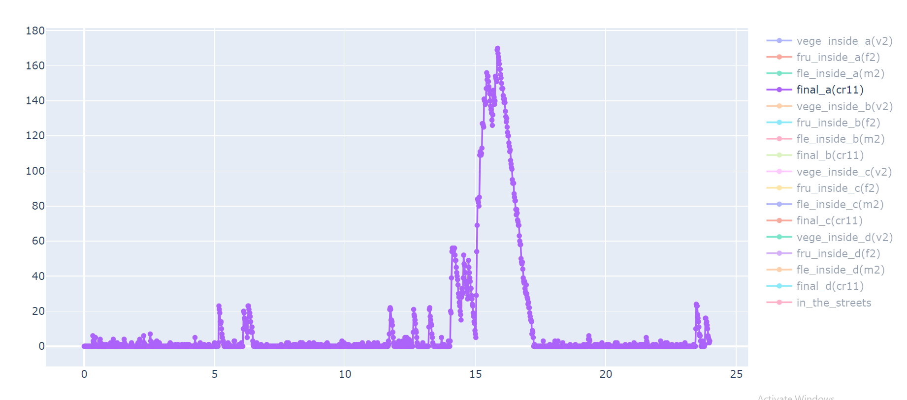

# Aplikace pro analýzu dat z prodejen obchodního řetězce


# 1. Datová sada

Data pochází ze systému, který obchodní řetězec provozuje pro zkvalitnění svých služeb. Používá k tomu kombinaci věrnostních karet, skenery zboží v nákupním košíku a chytře umístěných kontrolních bodů v prodejně. 

Data, se kterými budete pracovat pochází z dubna roku 2019. Jedná se o kolekci záznamů z jednotlivých prodejen uložené hierarchicky do adresářové struktury podle města, dnu v měsíci a konkrétní prodejny.
Součástí jména složky dne je pro jednoduchou rozšířitelnost uvedena také zkratka dne v týdnu.

V samotném datovém souboru jsou informace oddělené středníkem v tomto pořadí: 
Časová značka, identifikátor funkčního prvku(pokladna, kontrolní bod, vstup do prodejny), identifikátor zákazníka a v případě, že se jedná o koncovou pokladnu, je uvedena také částka, kterou zákazník za nákup zaplatil.

Čas je uveden ve vteřinách od začátku dne.
Přechody mezi jednotlivými kontrolnímy body pro jednoduchost zanedbávejme.

Data ke stažení : 
[[liks]](https://liks.fav.zcu.cz/adt/exam/service/download-data?filename=cities.zip)

# 2. Zadání

Aplikace načte vstupní soubory z disku a umožní uživateli analyzovat jednotlivé funkční části obchodního řetězce (obr. 1). 
Implementujte funkcionalitu, která umožní po spuštění programu odpovídat na otázky typu: 

Jak dlouhá je fronta v [15:00] ve městě [Plzeň] obchodu [A]


Schématické zobrazení realizace prodejny. Počty jednotlivých obslužných bodů (fialové) jsou proměnlivé. Žlutě jsou vyobrazeny fronty před jednotlivými obslužnými body. Fronty vznikají před samoobslužnými váhami na ovoce a zeleninu, obsluhovaným pultem s masem a před pokladnami. 

## Zásady pro vypracování
Argumenty programu ošetřete mimo samotný funkční kod.
Datové struktury zvolte podle typu úkolu, který chcete řešit. 

1. Načtete cestu ke kořenovému adresáři s daty (argument spouštěného programu).
2. Ověřte, že předaný argument je cesta k existující složce. 
3. Připravte třídu pro reprezentaci záznamu. 

```python
 class Record:
            ...
```
4. Vytvořte funkci, která načte data do vhodných datových struktur. Cestu k adresáři s daty přijme jako svůj parametr. Načtěme záznamy z celého měsíce. Doporučujeme roztřídit záznamy do slovníku podle pole ckpt. (I v našich strukturách zachovejme seřazení podle času,bude se nám hodit)

```python
def load_data(datapath:str ,city:str ,shop:str) -> dict[str, list[Record]]
```

5. Ověřte, že:
    1. Ošetříme hlavičku souborů, pokud je součástí. 
    2. Ošetříme proměnný počet polí na řádku (absence/přítomnost útraty)
    3. Řádek, který neobsahuje validní záznam přeskočte, informujte o tom ale uživatele. (chybějící pole, nebo neočekávaný datový typ)
    \end{enumerate}

6. Vytvořte funkci, která profiltruje načtená data podle konkréntího času. Využívejme toho, že ve vstupním souboru i v naší datové struktuře jsou data seřazená podle času. (Jak nám to pomůže?)

```python
def filter_data_time(data :dict[str, list[Record]], cond_time:int) -> dict[str, list[Record]]
```

7. Vytvořte funkci, která vrátí množinu identifikačních čísel zákazníků, které se týkají konkrétních bodů. 

```python
def get_passed_set(data : dict[str, list[Record]],key_words:list[str]) -> set[int]
```

8. Vytvořte funkci, která získá okamžitý stav fronty v konkrétní den a vteřinu pomocí množinových operací. Topologii prodejny uvažujte neměnnou. Mění se pouze počty obslužných bodů. 
```python 
def get_q_size(data :dict[str, list[Record]], seconds:int) -> int:   
```

9.  Vytvořte funkci, která na standardní výstup programu vypíše délku fronty pro každou celou hodinu pro

```python
def histogram(data :dict[str, list[Record]]):
```

10. Ve funkci main vstupte do smyčky která bude od uživatele přijímat vstup (město,obchod) vypisovat pro ně histogram.

pozn. očekávanou funkčnost můžete porovnat s referenčním záznamem z Plzně, který je přiložen k datům. Např final_a - fronta před pokladnami v obchodu a atp. 


# Další procvičení

Modifikujte program: 

- Vypište stav fronty po desetiminutových intervalech.
- Kromě délky fronty vypište také konkrétní zákazníky, kteří v ní stojí. 
- Ke smyčce implementujte lazy loading tak, aby se vždy v paměti držela pouze města, která uživatele zajímají. tj. načítala se při první žádosti o konkrétní město, ale v paměti zůstávala pro další použití.  

Zkuste odpovědět na další otázky: 


- V jakém z obchodů v Plzni bylo nejvíce lidí mezi 15. a 16. hodinou první den v měsíci?

# K zamyšlení

- Jaké má výhody použití množiny pro uložení zákazníků, kteří prošli konkrétním bodem prodejny?
- Bylo by možné nějak zachovat pořadí zákazníků ve frontě, bez ztráty rychlosti při operaci rozdílu nad průchodem oproti množině? 
- Co bychom museli udělat, abychom uměli dělat množinové operace nad množinou našich objektů Record? 

- Jakými způsoby lze řešit uložení do datových struktur pro otázky řízené intervalem útraty? Např.: Který den v týdnu a v jakou hodinu probíhají nejvíce nákupy v rozmezí (X,Y) (napr. za částky v rozmezí 5000-10000 Kč).
  - Lze řešit úlohu rozsekáním útrat do intervalů? 
  - Jak správně určete velikost intervalu?     
  - Lze řešit úlohu použitím seznamu nákupů seřazeného podle výše útraty?
  
- Při různých velikostech intervalu  100kč, 10kč, 1Kč, Halíře? Jaká jsou pro a proti?  
- Získáme něco, pokud bychom nepoužili rozdělení do intervalů, ale udrželi pouze posloupnost seřazenou podle útraty?
    
- Je možné úkol splnit jedním průchodem bez načítání dat do paměti?  


