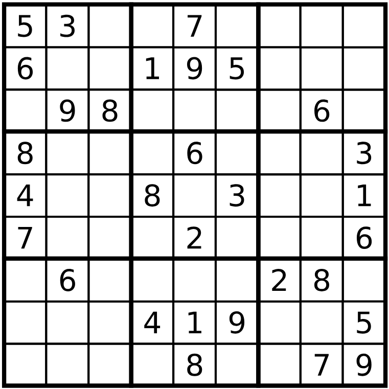

# Backtrackingu pro řešení Sudoku

## Zadání
Cílem je naprogramovat automatické řešení Sudoku s využitím algoritmu navracení (backtracking).




# Data
Vstupní data jsou ve formátu csv jako matice čísel 9x9. Prázdná políčka značí číslo 0. Vstupní
data pro obrázek výše by tedy vypadala následovně:

```
5;3;0;0;7;0;0;0;0
6;0;0;1;9;5;0;0;0
0;9;8;0;0;0;0;6;0
8;0;0;0;6;0;0;0;3
4;0;0;8;0;3;0;0;1
7;0;0;0;2;0;0;0;6
0;6;0;0;0;0;2;8;0
0;0;0;4;1;9;0;0;5
0;0;0;0;8;0;0;7;9
```


# Postup řešení
1. Vytvoříme třídu SudokuSolver, v konstruktoru inicializujeme prázdnou plochu. Pro reprezentaci pole použijte numpy.array.

```python 
class SudokuSolver:
    def __init__(self):
        self.field = np.zeros([9,9], dtype=int)
```


2. Implementujte kontrolu validity řešení. Řádky, sloupce i bloky nesmí obsahovat žádné číslo dvakrát.

```python
# generické pro všechny případy .. řádek, sloupec, blok
def check_sequence(self, sequence:list[int]) -> bool:
    pass

def check_row(self,row_index):
    # požijme check_sequence()
    pass

def check_column(self,column_index):
    # požijme check_sequence()
    pass

def check_block(self, r, c):
    # požijme check_sequence()
    pass

```

3. Implementujte kontrolu ne-kolize konkrétní buňky s pravidly.

```python 
def check_one_cell(self, r:int,c:int) -> bool:

```

4. Implementujte rekurzivní algoritmus s navracením pro řešení Sudoku. Algoritmus funguje následovně:
    1. Najdi volné políčko. Pokud žádné není, konec – vyřešeno.
    2. Zkus vyplnit postupně čísla 1-9 a ověřuj validitu. Pokud je rozmístění čísel validní jdi na bod 1, pokud ne, opakuj bod 2 s následujícím číslem.
    3. Pokud žádné s čísel 1-9 na aktuálním políčku nesplňuje podmínky, vrať se o políčko zpět a tam pokračuj následujícím číslem.

```python
def solve(self):
    pass
```

5. Zkuste spustit solve() na prázdné pole. Pokaždé stejné sudoku je docela nuda ne?
6. Upravte program tak, aby pokaždé vytvořil jiné sudoku.  

# Další cvičení: 
7. Implementujte generátor zadání postupným vyplňováním náhodných políček náhodnými čísly. Musíte zajistit, abyste vygenerovali zadání, které má řešení. Funkce bude mít na vstupu počet vyplněných polí – míru předvyplnění.
8. Řešení uložte do souboru ve stejném formátu jako je soubor vstupní.
9. Modifikujte algoritmus tak, abyste dostali počet všech validních řešení. Použijte návratovou hodnotu rekurzivní funkce pro posčítání celého stromu řešení.
10. Implementujte generátor zadání, který bude vycházet z plného pole a bude postupně odstraňovat náhodná čísla. Kontrolujte jednoznačnost řešení. Funkce bude mít na vstupu cílový počet prázdných polí.


