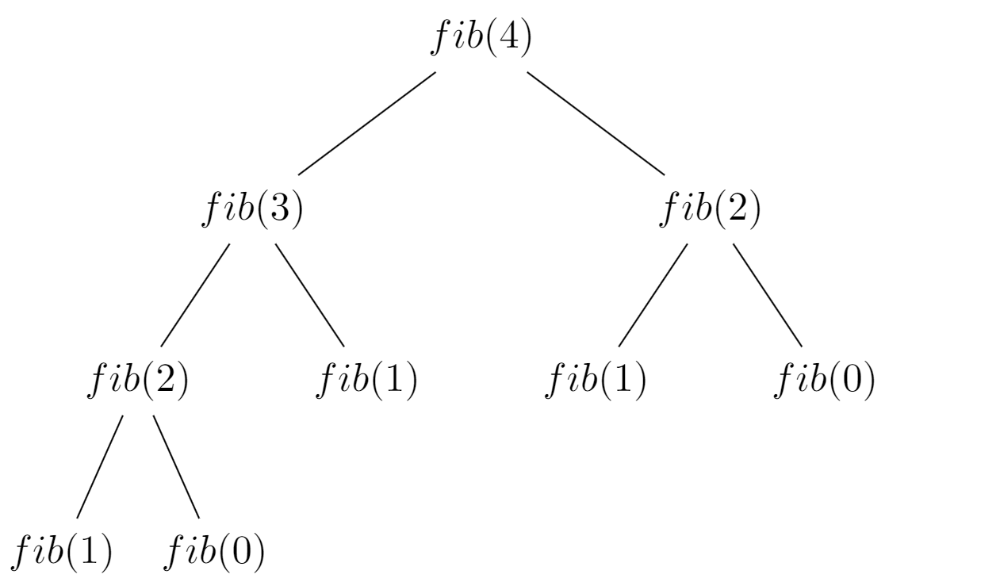
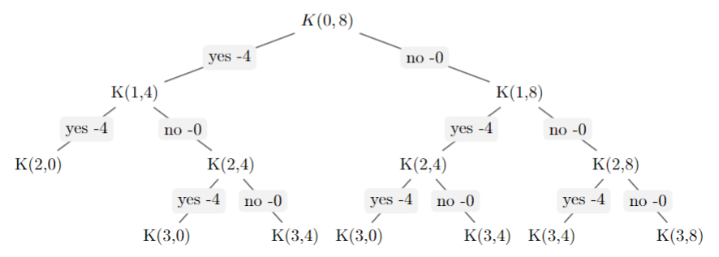
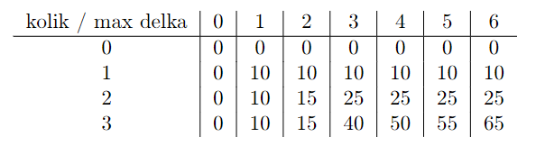

# Fibonacciho posloupnost

Fibonacciho posloupnost je dána rekurzivním předpisem:

$$fib(n) = fib(n − 1) + fib(n − 2)$$
$$fib(0) = 0$$
$$fib(1) = 1$$

K vypočítání n-tého členu Fibonacciho posloupnosti, můžeme využít rekurzi. Tento postup ale
není optimální, protože budeme stejné části počítat vícekrát, jak ukazuje následující strom řešení:




Algoritmus můžeme navrhnout efektivněji, když si budeme ukládat mezivýsledky.

1. Implementujme rekurzivní výpočet fibonačiho čísla podle předpisu.
```python
def fib(n:int) -> int:
    pass
```


Pokud zkusíme program spustit, zjistíme, že pro zvětšující se n je výpočet čísla velice neefektivní. Z výpočtového stromu je patrné, že počítáme stejnou věc několikrát, což vede na velice neefektivní výpočet. 


2. Vyhledáme část výpočtu, která se opakuje a pokusíme se jí identifikovat. V našem případě je možné použít číslo, které podstrom rozvíjí. Při prvním výpočtu si můžeme výpočet uložit a příště už jej nepočítat. 

3. Implementujme rekurzivní výpočet fibonačiho čísla s pamětí předchozích výpočtů. 

```python
def fib_mem(n:int ,lookup:dict[int,int]) -> int:

```

4. Porovnejme rychlost výpočtu obou implementací. 


# Mix hudby na párty. Praktické užití dynamického programování

## Zadání
Máte za úkol vytvořit mix hudby o dané maximální délce (CD, hudba na diskotéku), tak abyste zahrnuli co nejvíce dobrých písniček. 
Na vstupu dostanete seznam písniček, jejich délky a hodnocení
(oblíbenost). Vaším cílem je maximalizovat celkové hodnocení (součet hodnocení všech skladeb) a
přitom nepřekročit maximální délku.


## Data
Data jsou uložena v jednoduchém textovém formátu kde na každé řádce jsou údaje o jedné skladbě
kde je uloženo hodnocení a čas ve formátu mm:ss. Implementujme načítání dat. 

```python
def load_data(path) -> tuple[list[float], list[float]]:
    values : list[float]= [] # rating
    weights : list[float]= [] # délky v sekundách
    return values, weights
```


## Naivní implemntace

Úlohu lze řešit poměrně jednoduše s využitím algoritmu navracení, kdy vyzkoušíme zkrátka
všechny možnosti podobně jako v předchozí úloze. To znamená, vyzkoušíme všechny kombinace
rozhodnutí, kdy každou skladbu buď na mix zařadíme a nebo ne. Složitost takového řešení je tedy
O(2n) kde n je počet skladeb. Toto řešení ale není efektivní. Jeho nevýhody ukazuje následující strom řešení pro zjednodušený příklad, kde máme tři písničky, všechny jsou čtyři minuty dlouhé a vytváříme osmiminutový mix.

V každém kroku musíme vybrat lepší ze dvou možností, buďto danou skladbu do mixu přidáme,
nebo ne. řešení K(0, 8) znamená že se rozhodujeme o první skladbě a 8 minut do kterých vkládáme.
Skladbu buďto zahrneme K(1, 4) nebo nezahrneme K(1, 8).




##  Dynamické programování
Na obrázku můžeme vidět, k řešení K(2, 4) se dostaneme různými cestami (různé kombinace před-
chozích skladeb, mají stejnou délku) a backtracking tedy počítá stejné věci vícekrát (stejně jako
v případě Fibonacciho posloupnosti). S narůstající hloubkou řešení se to bude stávat mnohem
častěji. Když tedy problém vhodně dekomponujeme, můžeme se opakovanému výpočtu vyhnout.
Toho můžeme dosáhnout prostým přidáním ukládání výsledků do backtrackingového řešení. Problém stále řešíme rekurzivně (odzhora dolů) jen si zaznamenáváme mezivýsledky pro pozdější
použití.


# Jak si příště usnadnit práci? 
1. Upravte úlohu pro výpočet fibonacciho čísla a použijte @functools.cache pro ukládání výsledků. 
```python 
@functools.cache
def fib_cache(n:int) -> int:
    pass
```


# Motivace a Další materiály


Přklady, kde se DP používá: 
- řetězce
- FFT
- řezání materiálů
- optimální naplnění skladu
- investiční portfolia
- kryptografie (např, Merkle-Hellman)

### Další studijní materiály
- Jak souvicí Dynamické programování se studenou válkou? https://www.youtube.com/watch?v=nmgFG7PUHfo

- Více okolo DP https://www.youtube.com/watch?v=Hdr64lKQ3e4


# Fibonacci jinak 
Dalo by se fibonacciho číslo vypočítat jinak? 
- ne shora ale odspodu? 
- s minimální užitou pamětí pro ukládání předchozích výpočtů? 

Dynamicé programování je velice mocná technika. Transformace úlohy pro aplikaci dynamického programování mnohdy není přímočará a identifikovat duplicitní část stavového prostoru úlohy je náročné a analýza úlohy  může vyžadovat nezanedbatelný čas a úsilí. To, jakým způsobem dokážeme úlohu analyzovat a identifikovat v ní opakující se výpočty, navíc je použít pro urychlení výpočtu s minimální paměťovou náročností je to, čeho bychom chtěli dosáhnout. 


# Další cvičeí
1. Implementujte hladový algoritmus pro úlohu párty mixu. 
    - změřte rychlost a správnost řešení. 
    - jakou cenu platíme za rychlost/správné řešení


# Apendix

Další možné řešení (méně intuitivní) odstraňuje rekurzi a staví řešení odspoda nahoru s využitím tabulky. 
To spočívá v dekompozici problému na vzájemně se nepřekrývající podproblémy a jejich využití k řešení celého problému s tím, že řešení podproblémů se ukládá do paměti, protože podproblémy se ve stavovém stromu řešení opakují. 
U dynamického programování řešíme problém ”odspodu” stavového stromu. Stav naší úlohy je dán délkou mixu (obecně kapacitou) a počtem skladeb, které jsme se pokusili na mix umístit. Začneme tedy odspodu řešit úlohu. pokud je kapacita, nebo počet skladeb nulový, celkové hodnocení je zjevně také 0, dále pro ostatní případy, můžeme vždy aktuální skladbu buď přidat nebo nepřidat. 
Vybíráme maximum. Na pozici $i$, $j$ máme tedy uložené maximální hodnocení mixu z prvních $i$ skladeb, při celkové délce $j$. Když se rozhodujeme, jestli itou skladbu přidat vybíráme maximum ze dvou možností:

1. hodnota $K(i − 1, j)$ – skladbu nepřidáme, hodnocení je stejné jako pro předchozí hodnotu $i$
2. hodnota $K(i−1, j −d_i +h_i)$ – skladbu předáme. celkové hodnocení se zvýší o hodnocení aktuální skladby hi ale obsadíme $d_i$ minut – přičítáme k nejvyššímu hodnocení s nižší maximální délkou o $d_i$.

Na konci hodnota v poslední buňce tabulky je naše řešení. Vlastně máme řešení pro všechny možné
maximální délky od jedné až do N minut.



