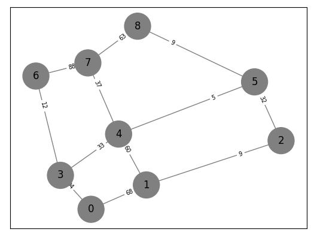

# Motivace pro grafové úlohy
- Sociální sítě
    - Facebook, Instagram (vztahy mezi lidmi, možná znáte)
    - Youtube, Spotify (personalizovaný obsah)
- CSFD, IMDB
- E-shop
    - Společné nákupy různých uživatelů je profiluje (Společně s tímto lidé nakoupili také)
    - Doporučovací systémy
- Dopravní sítě
    - Optimalizace při stavbě
    - Navigace (optimalizace podle: vzdálenosti, rychlosti, ekonomičnosti...)


# Implementace grafu
Implementujte graf pomocí seznamu sousednosti.

1. Vytvořte třídu pro reprezentaci uzlu v grafu. Hrany realizujte pomocí seznamu sousednosti. 
```python
class Node:
    def __init__(self, id) -> None:
        self.id: int = id  # identifikátor uzlu
        self.neighbors: list[tuple[float, Node]] = list()  # (váha hrany, (kam_se_dostanu))
```

2. Vytvořte třídu pro reprezentaci grafu. 
    - třída obsahuje slovník se všemi svými uzly
    - množinu všech hran

```python 
class Graph:
    def __init__(self) -> None:
        self.nodes: dict[int, Node] = dict()
        self.edges: set = set()
```

3. Vytvořte metodu pro třídu Graph, která umožní graf rozšířit o uzel. 
```python
def add_node(self, node: Node)
```

4. Vytvořte metodu pro třídu Graph, která umožní do grafu přidat hranu mezi dva existující uzly. 
```python
def add_edge(self, src: Node, dst: Node, weight=0)
```

5. Napište funkci, která načte graf ze souboru ve formátu json. Použijte balík json. Ve složce 'data' je k dispozici více grafů různých velikostí pro testování. 
např : graph_grid_s3.json



6. Pokud dodržíte rozhraní ze zadání, můžete pro vizualizaci použít knihovničku 
https://github.com/JakubSido/adthelpers

- Jednoduše pro graf
```python
painter = adthelpers.painter.Painter(graph) 
```
- pro vizualizace průběhu algoritmu

```python
    painter = adthelpers.painter.Painter(
        graph,
        visible=q, # Prioritní fronta
        closed=closed, # množina uzavřených uzlů
        color_edges=spanning_tree, # aktuální kostra
        wait_for_key=False  # neblokující draw_graph(): animaci budeme řídit během např. debugerem
    )
    painter.draw_graph(actual_node)
```

# Prim-Jarníkův algoritmus
Najde minimální kostru. Implementujte Prim-Jarníkův algoritmus pomocí námi implementované reprezentace grafu
- Co je kostra? 
- Záleží kde začnu?

## Algoritmus
Algoritmus pracuje s množinou objevených uzlů a hran k nim vedoucích

1. Vyberu počáteční uzel 
2. Vyberu hranu $e^⋆$, která vede do neuzavřeného uzlu V. Přidám $e^⋆$ do kostry.
    - Všechny hrany, které vedou z uzlu $V$ přidám do fronty.
    - Uzel uzavřu

    Algoritmus pracuje s
    - Množinou hran – již objevenou kostrou
    - Množinou hran, které vedou z kostry ven (tudy můžeme rozšiřovat)
    - hledáme vždy tu nejlevnější tedy je vhodné použít prioritní frontu (PriorityQueue z balíku queue)
    - do prioritní fronty přidávejme hranu jako tuple (weight, (from_id, to_id),)


# K zamyšlení
1. co kdybychom nepoužili prioritní frontu? dostaneme kostru? A/N
2. jakou kostru dostaneme? 

3. Jaký je vztah mezi mezi kostrou a nejkratší cestou?
4. Je např. pravda, že po kostře vede nejkratší cesta mezi vrcholy? 

4. Ohodnocení hrany může mít různé významy:
    - hledám nejkratší cestu? potom jsou to asi kilometry
    - hledám nejrychlejší cestu? může mne zajímat i povolená rychlost na daném úseku 
    - v sociálních sítích bude hrana obsahovat mnohem více informací. 
        - typ vztahu (rodina-sourozenec, partner), 
        - datum vzniku, 
        - datum ukončení
        

5. K čemu se dá použít kostra? 
    - Návrh elektrické rozvodné sítě
    - Odvodňovací kanály
    - Síťová konektivita
     
    


např : 
graph_grid_s3.json


graph_grid_s3_3.json


