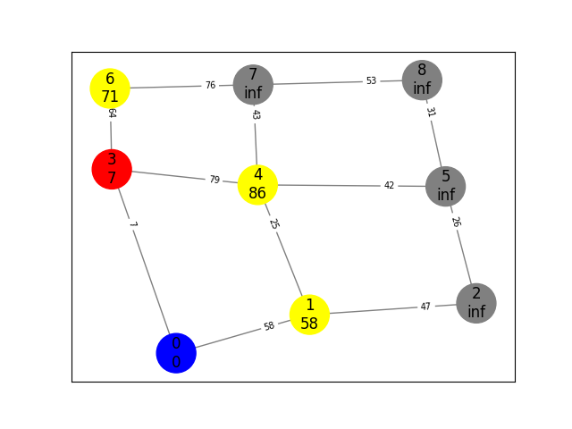

# Nejkratší cesta v grafu
1. Použijme implementaci grafu z předchozího cvičení 
    ```python
    from spanning import Graph # například takto můžeme importovat z minulého cvičení
    ```
2. Implementujme Dijkstrův algoritmus pro nalezení nejkratší cesty v grafu. 
3. Pro vizualizaci můžeme použít knihovnu adthelpers (viz předchozí cvičení)


# Další cvičení
1. Načtěte data města Plzeň z přiložených datových souborů
    - Jak už tomu s dodanými daty často bývá, nejsou ve formátu, který se nám hodí. 
    - Pro naše účely použijeme pouze několik kusů informace:
        - informace o hranách - soubor pilsen_edges.csv
            - source - id uzlu, kde hrana začíná
            - target - id uzlu, které hrana končí
        - informaci o uzlech - soubor pilsen_nodes.csv 
            - id - id uzlu
            - WKT - geo souřadnice
    - Pro váhu hran mezi jednotlivými uzly pro začátek použijeme vzdálenost mezi body, kterou si spočítáme ze souřadnic spojovaných bodů.
        - pro vzdálenost mezi dvěma body můžete použít knihovnu geopy (geopy.distance.geodesic(A,B))
        
2. Můžeme použít naši implementaci grafu. Pro praktické úlohy bude vhodnější udělat drobné úpravy. 
    - Rozhraní, které je použité pro přidávání uzlu a hran je názorné, avšak trochu nepraktické. 
    - Jako uživatel knihovny potřebujeme pro tvorbu (stavbu) grafu pouze jednu základní funkcionalitu - vytvoř hranu id-id. 
    - Pokud v grafu neexistuje uzel s konkrétním id, nechceme se starat o jeho vytváření a udržování konzistence objektů. Tuto funkcionalitu tedy můžeme implementovat v nové metodě třídy Graph. 
    ```python
    def add_edge_id(self, src_id: int, dst_id: int, weight: float = 0):
        # spoj uzel src_id a dst_id hranou
        # pokud takové uzly v grafu nejsou, nejprve je vytvoř.     
    ```
    - Funkcionalita je velice podobná jako ta z minulého cvičení. Při používání nové implementace už se ale nemusíme starat o to, jestli konkrétní uzly v grafu máme. Což je mnohem pohodlnější a oceníme to při implementace načítání ze souboru. 
    - Upravme implementaci pro orientované grafy, data z dopravního prostředí jsou totiž ze své podstaty orientovaná (jednostměrky, nájezdy na dálnice, kruhové objezdy...).

3.  Implementujte funkci `load_edges()` a `load_nodes()`. Pro bližší informace viz docstring v main.py 
4. Najděte nejkratší cestu z Červeného Hrádku (id:4651) do Zbůchu(id:4569)


5. Vizualizujte cestu pomocí knihovny plotly (https://plotly.com/python/lines-on-mapbox/)
    

6. Najděte opačnou cestu: ze Zbůchu do Čerevného hrádku.  Je cesta stejná? Proč? 

# K zamyšlení
1. Jaký vliv má námi použitá metrika na nalezenou cestu? 
2. Jak by se výsledek změnil, pokud bychom použili jinou metriku? Například bychom uvažovli také počet pruhů, propustnost silnice, nebo povolenou rychlost?
3. Jaký je vztah mezi mezi kostrou a nejkratší cestou?
4. Je např. pravda, že po kostře vede nejkratší cesta mezi vrcholy? 

5. K čemu se dá použít nejkratší cesta?
    - Navigace v libovolném prostředí. (doprava, robotické vysavače, počítačové hry)


# Příklad funkce algoritmu
průchodu graph_grid_s3_3.json 
Cesta z 0 do 5 


- found shortcut from  0  to  1 inf -> 58
- found shortcut from  0  to  3 inf -> 7



- found shortcut from  3  to  6 inf -> 71
- found shortcut from  3  to  4 inf -> 86


- found shortcut from  1  to  2 inf -> 105
- **found shortcut from  1  to  4 86 -> 83**


- found shortcut from  6  to  7 inf -> 147


- **found shortcut from  4  to  7 147 -> 126**
- found shortcut from  4  to  5 inf -> 125


Cíl - 5 - uzavřeno - hotovo


